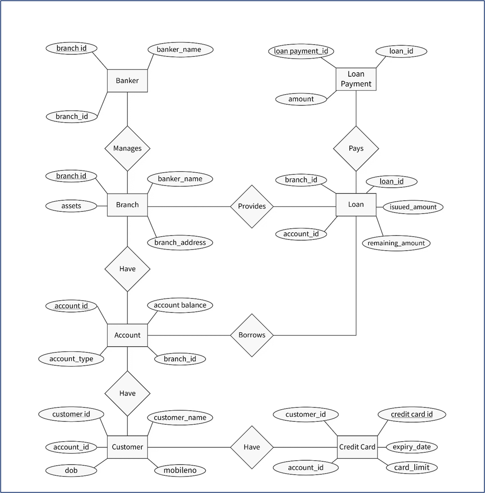

# 🏦 Banking System Project

## 📌 Overview
This project is a **Banking System Database** designed to manage:
- Customers
- Accounts
- Loans & Loan Payments
- Credit Cards
- Bank Branches & Bankers

It includes **ERD design, schema, and SQL queries**. The system supports essential banking operations such as:
- Customer account creation
- Loan management
- Loan repayments
- Credit card issuance
- Banker and branch management

## 📂 Repository Structure
```
Banking-System-Project-DBMS/
│── Queries.sql # SQL schema & queries
│── README.md # Documentation
```

## ⚙️ How to Run
1. Install a SQL database (MySQL / SQL Server / PostgreSQL).
2. Open your SQL client.
3. Run the commands from **queries.sql**.
4. Test with provided sample queries.

## 📊 Database Schema
The database consists of the following tables:
- **Branch**
- **Banker**
- **Customer**
- **Account**
- **Loan**
- **LoanPayment**
- **CreditCard**

## 🚀 Features
- Create and manage customer accounts
- Track balances and transactions
- Manage loans and repayments
- Assign bankers to branches
- Issue and manage credit cards

## 📊 ER Diagram


---

👨‍💻 Developed as part of a **Database Management System Project**
